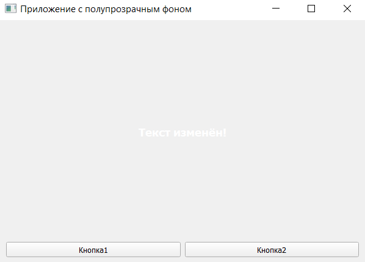

# Лабораторная работа 1: Приложение с полупрозрачным фоном на PyQt5

## Описание

Данное приложение реализовано на **PyQt5** и демонстрирует:

- Использование `QMainWindow`, `QWidget`, `QLabel`, `QPushButton`, `QFileDialog`
- Загрузку PNG-изображений с прозрачностью
- Динамическое изменение размера окна под размер изображения
- Максимизацию окна при загрузке слишком большого изображения
- Отображение полупрозрачного фона с помощью `QPainter`
- Изменение текста метки по нажатию кнопки

---

## Функционал

1. **Кнопка1** — изменяет текст надписи между "Надпись" и "Текст изменён!"
2. **Кнопка2** — открывает диалог выбора PNG-файла и устанавливает его как полупрозрачный фон окна
3. **Автомасштабирование окна**:
   - Если изображение **меньше экрана** → окно подстраивается под его размер
   - Если **больше экрана** → окно **максимизируется**
4. **Полупрозрачный фон** — изображение отображается с 70% прозрачностью
5. **Виджеты остаются на переднем плане** и остаются интерактивными

---

## Требования

- Python 3.6+
- PyQt5 (`pip install PyQt5`)

---

## Структура проекта

```
LR1/
├── main.py          # Основной файл
├── README.md        # Данный файл
└── screenshots/     # Папка для скриншотов
```

---

## Скриншоты работы программы

1. **Исходное окно при запуске приложения**  
   

3. **После нажатия "Кнопка1"**  
   

3. **После загрузки небольшого изображения (меньше экрана)**  
   

4. **После загрузки большого изображения (больше экрана)**  
   

---

## Автор

Миролюбов Вячеслав Борисович

Группа: 6233-010402D
