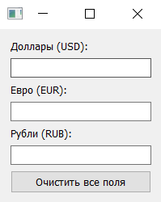
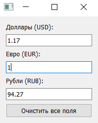
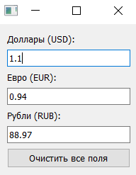

# Конвертер валют на PyQt

Простое приложение для конвертации валют (USD, EUR, RUB), написанное на **PyQt5** с использованием архитектуры сигналов и слотов.

## Особенности

- Три поля ввода: доллары (USD), евро (EUR), рубли (RUB)
- Автоматический пересчёт при вводе в любое поле
- Курсы валют подтягиваются из публичного API ([ExchangeRate-API](https://exchangerate-api.com/)) при запуске программы
- Использование сигналов и слотов для обмена данными между компонентами
- Три файла с отдельными сигналами для каждой валюты:
  - `usd_signals.py` — сигнал `usd_changed`
  - `eur_signals.py` — сигнал `eur_changed`
  - `rub_signals.py` — сигнал `rub_changed`
- Общие сигналы в `common_signals.py`:
  - `clear_all` — очистка полей
  - `rates_updated` — обновление курсов
- Кнопка **"Очистить все поля"**
- Все импорты находятся в `main.py`

## Требования

- Python 3.6+
- PyQt5

Установка зависимостей:

```bash
pip install PyQt5
```

## Запуск

```bash
python main.py
```

## Структура проекта

```
.
├── main.py               # Точка входа, инициализация приложения
├── usd_signals.py        # Сигнал для USD
├── eur_signals.py        # Сигнал для EUR
├── rub_signals.py        # Сигнал для RUB
├── common_signals.py     # Общие сигналы (очистка, обновление курсов)
├── currency_converter.py # Логика и интерфейс конвертера
└── README.md
```

## Скриншоты работы программы

1. **Исходное окно при запуске приложения**  
   

3. **После ввода в поле EUR**  
   

3. **Обновление в строке USD**  
   

4. **После нажатия Очистить все поля**  
   

## Использование

1. При запуске программы курсы валют подтягиваются из API
2. Введите значение в любое из полей — остальные поля обновятся автоматически
3. Используйте кнопку **"Очистить все поля"**, чтобы сбросить значения

## API

Для получения курсов валют используется:
```
https://api.exchangerate-api.com/v4/latest/USD
```

## Автор

Миролюбов Вячеслав Борисович

Группа: 6233-010402D