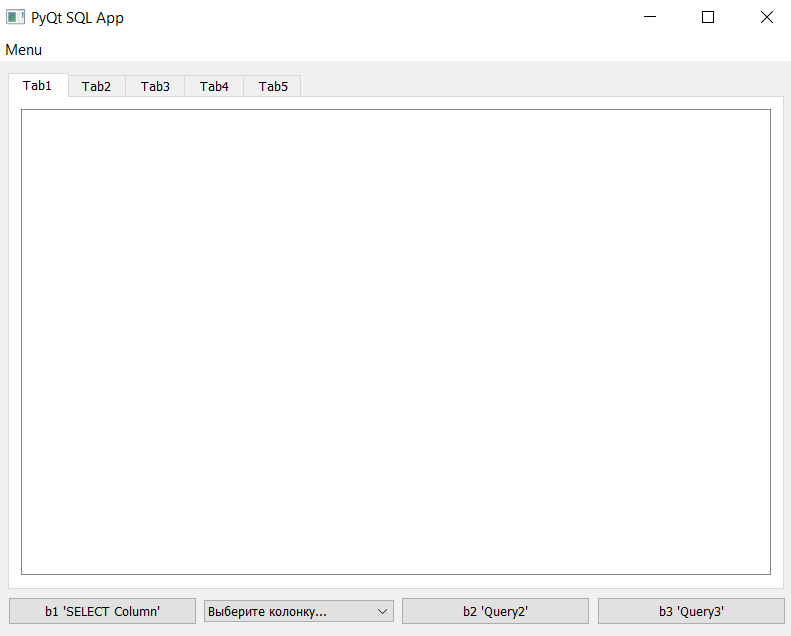
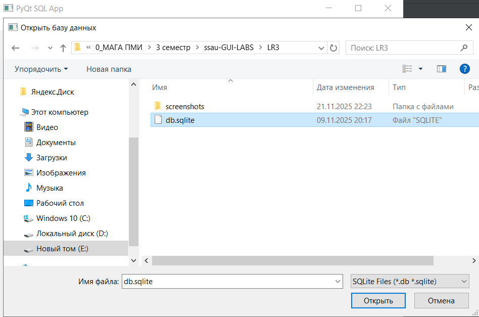
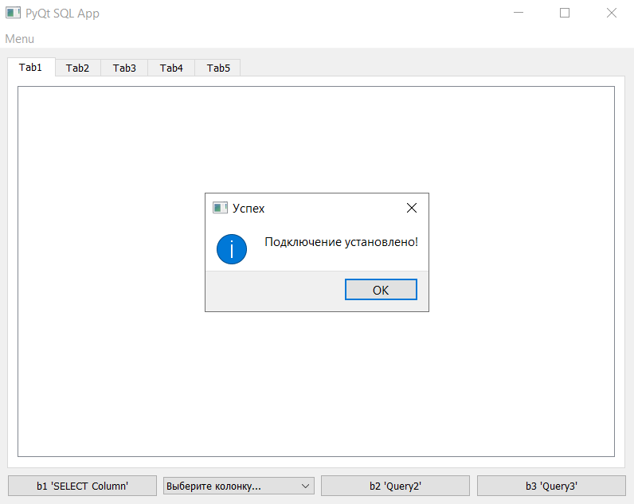
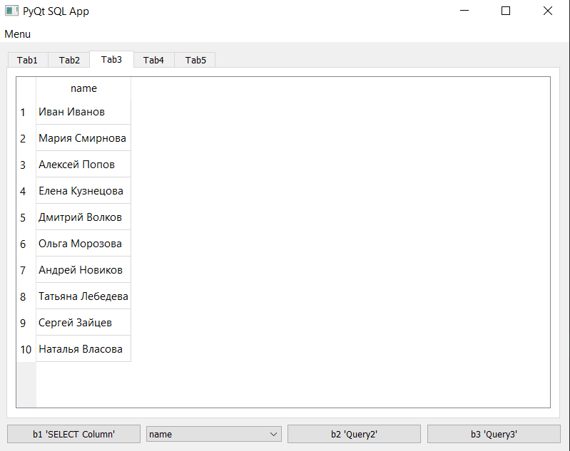
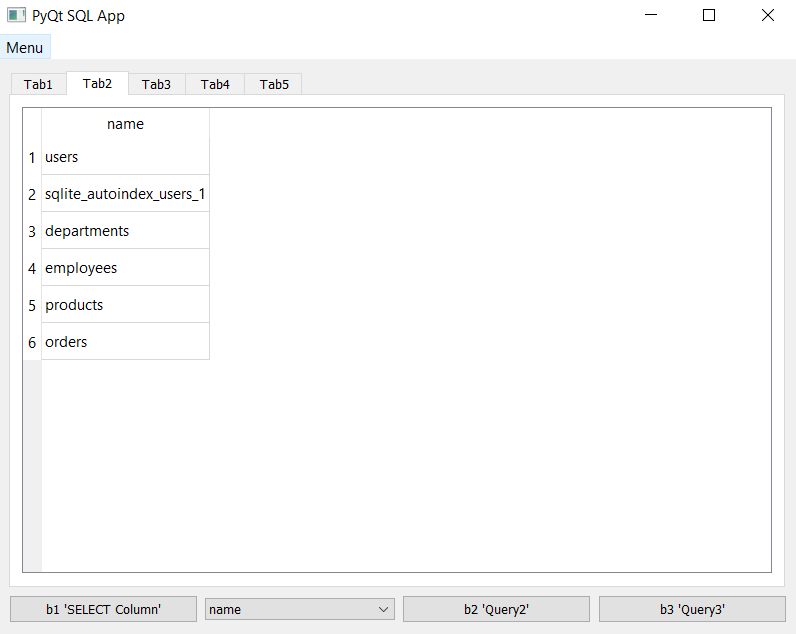
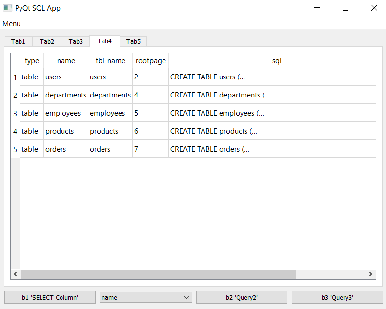
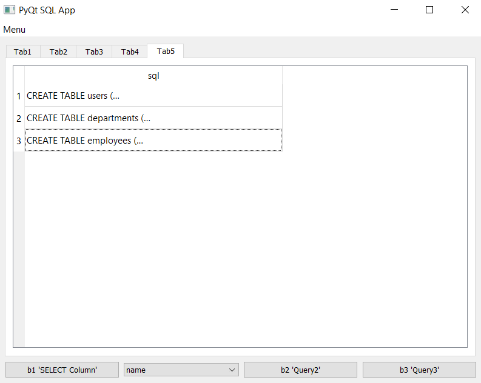
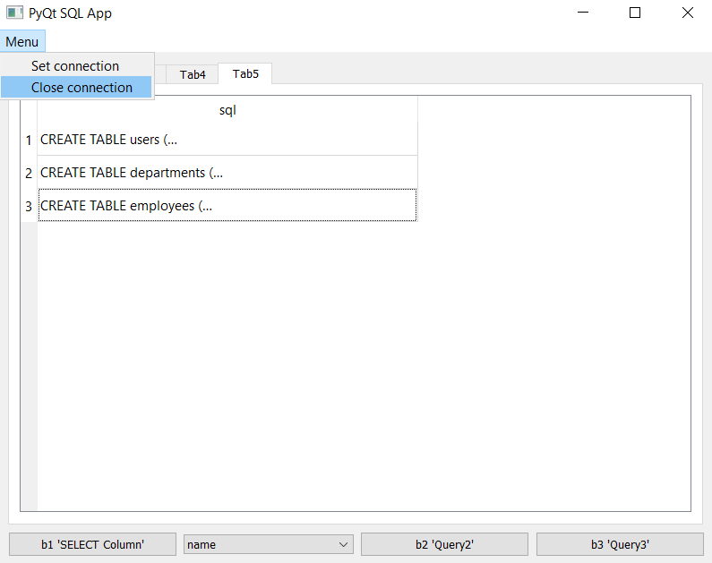
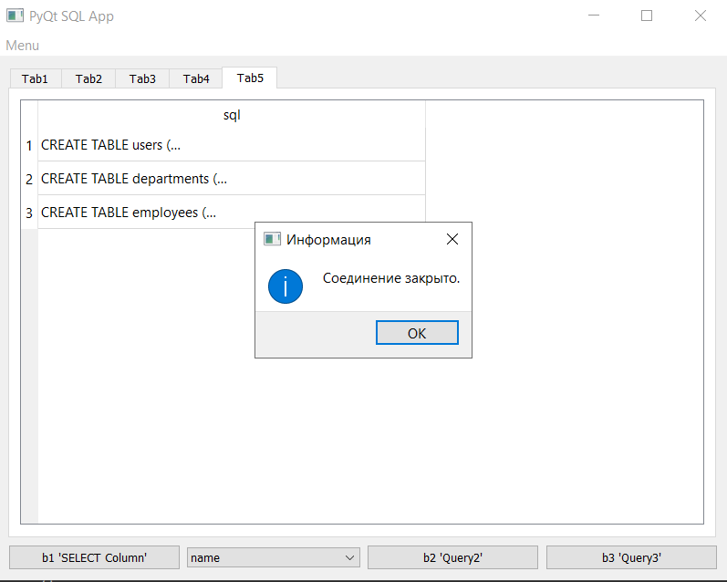

# PyQt SQL App

Простое приложение для просмотра и анализа SQLite баз данных, написанное на **PyQt5** с использованием архитектуры сигналов и слотов и встроенной поддержки SQL.

## Особенности

- Подключение к SQLite базе данных через диалог выбора файла
- Интерфейс с **5 вкладками** для отображения результатов различных SQL-запросов
- Предустановленные кнопки для выполнения часто используемых запросов:
  - `b1`: `SELECT name FROM sqlite_master`
  - `b2`: `SELECT * FROM sqlite_master WHERE type='table' LIMIT 5`
  - `b3`: `SELECT sql FROM sqlite_master WHERE type='table' LIMIT 3`
- Выпадающий список для выбора колонки из первой таблицы и отображения её данных (Tab3)
- Автоматическое обновление списка колонок при подключении к БД
- Отображение структуры БД (таблицы, столбцы, типы данных) и содержимого таблиц
- Использование `QSqlDatabase` и `QSqlQuery` для работы с базой данных
- Встроенный отладочный вывод в консоль (`print`)
- Кнопки для открытия и закрытия соединения с базой данных
- Все импорты находятся в `main.py`

## Требования

- Python 3.7+
- PyQt5

Установка зависимостей:

```bash
pip install PyQt5
```

## Запуск

```bash
python main.py
```

## Структура проекта

```
.
├── main.py               # Точка входа, инициализация приложения и основная логика
├── db.sqlite             # Файл БД
├── fill_db.py            # Скрипт для заполнения БД (запускался 1 раз)
└── README.md
```

## Использование

1. Запустите `main.py`
   
 
2. В меню `Menu` выберите `Set connection` и укажите файл `.db` или `.sqlite`






3. Вкладка `Tab1` автоматически заполнится структурой БД (`SELECT * FROM sqlite_master`)


4. Выберите колонку из выпадающего списка — данные появятся в `Tab3`



5. Нажмите кнопки `b1`, `b2`, `b3` для выполнения соответствующих запросов и отображения результатов в `Tab2`, `Tab4`, `Tab5`






6. Используйте `Close connection` для отключения и очистки всех вкладок





После этого приложение вернется в начальное состояние

## Используемые компоненты

- `QSqlDatabase.addDatabase("QSQLITE")` — подключение к SQLite
- `QSqlQuery` — выполнение SQL-запросов
- `QTableWidget` — отображение результатов запросов в табличном виде
- `QFileDialog` — диалог выбора файла базы данных
- `QMessageBox` — уведомления об ошибках и успехе подключения

## Автор

Миролюбов Вячеслав Борисович

6233-010402D
